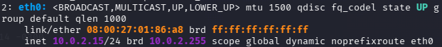
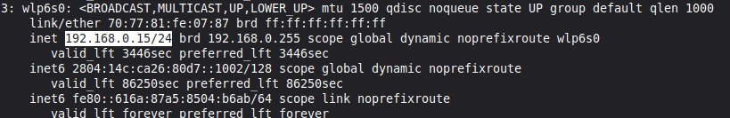
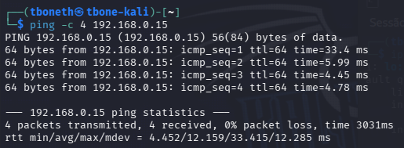
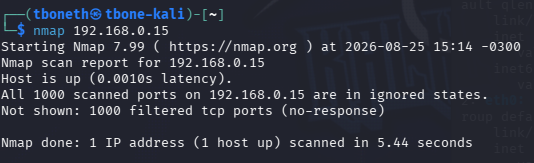
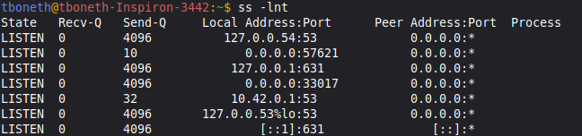
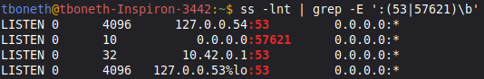
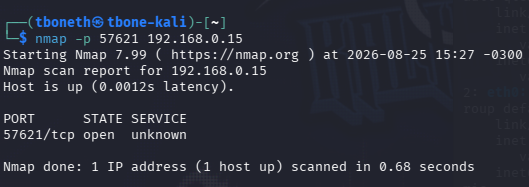
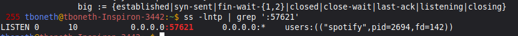

#  LAB 001 — Who Is There?

> **Categoria:** Network Reconnaissance / Service Enumeration  
> **Objetivo:** realizar reconhecimento de um host Linux em uma rede de laboratório, identificar portas TCP acessíveis e correlacionar uma porta encontrada com o processo responsável.

##  Objetivo

Neste laboratório foi realizada uma investigação prática utilizando uma máquina **Kali Linux** como estação de análise e um **Linux Mint** como alvo controlado.

A investigação seguiu o fluxo:

**conectividade → reconhecimento → enumeração → validação da porta → identificação do processo.**

---

##  Ambiente

| Máquina | Função | Endereço |
|---|---|---|
| Kali Linux | Máquina de análise / scanner | `10.0.2.15` |
| Linux Mint | Host alvo | `192.168.0.15` |

O Kali estava sendo executado em uma máquina virtual através do VirtualBox.

---

## 1.  Verificação de conectividade

A primeira etapa foi confirmar o endereço do Kali e do host Linux Mint antes de iniciar o reconhecimento.



> **Análise:** O Kali estava configurado com o endereço `10.0.2.15` dentro da interface virtual.

No host alvo, o Linux Mint estava configurado com `192.168.0.15/24`.



> **Análise:** Com os dois endereços identificados, foi possível testar a comunicação entre as máquinas.

A conectividade foi validada com um `ping` do Kali para o Mint.



> **Análise:** O host respondeu aos quatro pacotes enviados, confirmando que o alvo estava alcançável.

## 2.  Reconhecimento inicial com Nmap

Foi executado primeiro um scan padrão para verificar as portas mais comuns do host.



> **Análise:** O scan inicial não apresentou portas TCP abertas entre as portas verificadas.

## 3.  Enumeração local de sockets

Como o scan completo estava apresentando aumento de atraso e retransmissões, a análise foi complementada diretamente no Linux Mint com `ss -lnt`.



> **Análise:** Foram encontrados vários sockets em estado `LISTEN`. Entre eles, chamou atenção a porta `57621` vinculada a `0.0.0.0`, indicando escuta em todas as interfaces IPv4.

A saída foi filtrada para observar especificamente as portas relevantes.



> **Análise:** A porta `57621` apareceu como `0.0.0.0:57621`, tornando-a uma candidata para validação a partir do Kali.

## 4.  Validação da porta 57621

Em vez de aguardar outro scan de 65.535 portas, foi feito um teste direcionado à porta descoberta.



> **Análise:** O Nmap confirmou `57621/tcp open`, porém identificou o serviço como `unknown`. Isso significa apenas que a identificação automática do Nmap não determinou o serviço.

## 5.  Correlação entre porta e processo

Para descobrir qual processo estava utilizando a porta, foi executado `ss -lntp | grep ':57621'` no Mint.



> **Análise:** A consulta associou a porta `57621` ao processo do Spotify. Assim, foi possível correlacionar a descoberta remota do Nmap com a informação local do host.

## 6.  Resultado da investigação

A investigação demonstrou um fluxo completo de reconhecimento e enumeração:

1. Os endereços de rede do Kali e do Mint foram identificados.
2. A conectividade entre as máquinas foi validada.
3. Foi realizado um reconhecimento inicial com Nmap.
4. O scan completo apresentou comportamento lento devido às condições do caminho de rede.
5. A análise foi complementada no Mint utilizando `ss`.
6. A porta `57621/TCP` foi encontrada em estado de escuta.
7. A porta foi validada remotamente pelo Kali.
8. O Nmap classificou o serviço como `unknown`.
9. A análise local correlacionou a porta ao processo **Spotify**.

##  O que foi aprendido

- Diferença entre reconhecimento de portas e identificação de serviços.
- Como interpretar uma porta `open` com serviço `unknown`.
- Diferença entre endereços de loopback (`127.0.0.x`) e `0.0.0.0`.
- Como utilizar `ss` para investigar sockets em estado `LISTEN`.
- Como relacionar uma porta de rede a um processo local.
- Como validar resultados de uma ferramenta utilizando outra fonte de informação.
- Como adaptar uma metodologia de reconhecimento quando um scan amplo se torna pouco eficiente.

##  Escopo e segurança

Este laboratório foi realizado em equipamentos e rede sob controle do autor, com finalidade educacional.

As técnicas foram utilizadas exclusivamente no ambiente de teste.

##  Conclusão

O principal objetivo do laboratório não foi apenas encontrar uma porta aberta, mas praticar o processo de investigação.

O Nmap encontrou:

```text
57621/tcp open unknown
```

Enquanto a análise local do host revelou:

```text
0.0.0.0:57621 → Spotify
```

A correlação entre essas duas evidências permitiu identificar o processo responsável pela porta encontrada.

> **Resultado final: TCP/57621 → Spotify**

Esse processo de validação e correlação é uma base importante para atividades de reconhecimento de rede, análise de serviços e troubleshooting em cibersegurança.
