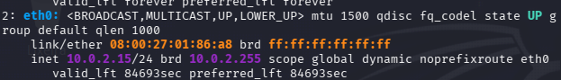
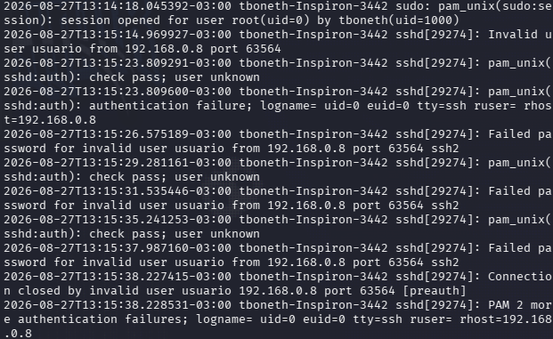
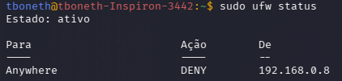

#  LAB 002 — Brute Force Não Autorizado

> **Categoria:** Log Analysis / Detecção de Intrusão  
> **Objetivo:** simular um ataque de força bruta via SSH contra um host Linux em uma rede de laboratório, identificar o padrão de ataque no log de autenticação e aplicar uma medida de contenção.

##  Objetivo

Neste laboratório foi realizada uma investigação prática de detecção, utilizando uma máquina **Kali Linux** como origem do ataque e um **Linux Mint** como alvo controlado.

A investigação seguiu o fluxo:

**simulação do ataque → coleta da evidência no log → análise do padrão → contenção.**

---

##  Ambiente

| Máquina | Função | Endereço |
|---|---|---|
| Kali Linux | Origem do ataque (comandos executados aqui) | `10.0.2.15` (NAT) |
| Windows (host) | Ponto de saída do tráfego na rede local, devido ao NAT do Kali | `192.168.0.8` |
| Linux Mint | Host alvo | `192.168.0.X` |

O Kali estava sendo executado em uma máquina virtual através do VirtualBox, com o adaptador de rede em modo **NAT**. Por esse motivo, o tráfego originado no Kali é traduzido para o IP do host (Windows) antes de alcançar outras máquinas da rede local — comportamento relevante para a análise do log, detalhado na seção 4.

---

## 1.  Confirmação da origem do ataque

Antes de iniciar a simulação, o endereço do Kali foi confirmado para permitir a correlação posterior com o log de autenticação do alvo.



> **Análise:** O Kali estava configurado com o endereço `10.0.2.15`, característico do modo NAT do VirtualBox. Como esse modo isola a VM em uma sub-rede virtual própria, todo tráfego destinado à rede local (`192.168.0.x`, onde está o Mint) é roteado através do adaptador de rede do host, com tradução de endereço (NAT).

## 2.  Simulação do ataque de força bruta

A partir do Kali, foram realizadas múltiplas tentativas de autenticação SSH contra o Mint, utilizando um usuário inexistente e senhas incorretas de propósito, com o objetivo de gerar um padrão de falhas de autenticação no log do alvo.

## 3.  Coleta da evidência no log

No Mint, o arquivo `/var/log/auth.log` foi monitorado em tempo real com `tail -f` durante o ataque.



> **Análise:** O log registrou seis tentativas de autenticação falhas em aproximadamente 23 segundos, todas originadas do mesmo IP (`192.168.0.8`) e da mesma porta de origem (`63564`), utilizando o usuário `usuario` — que não existe no sistema. A sessão foi encerrada pelo próprio SSH (`Connection closed by invalid user`), seguida de um resumo do PAM (`2 more authentication failures`) referente às tentativas restantes que não geraram log individual.

## 4.  Análise do padrão de ataque

Um ponto importante antes de analisar o padrão: o IP registrado pelo Mint (`192.168.0.8`) não é o IP interno do Kali (`10.0.2.15`), e sim o do host Windows. Isso ocorre porque o Kali está com o adaptador de rede em modo **NAT** — o tráfego sai da VM, é traduzido pelo VirtualBox e sai para a rede local usando o endereço do host. Do ponto de vista do Mint, a origem observável do ataque é essa tradução, não o dispositivo real que executou o comando. Esse é um comportamento normal em ambientes de laboratório virtualizados e um lembrete prático de que, em uma investigação real, o IP registrado em log corresponde ao último salto de rede antes do destino — não necessariamente ao dispositivo físico ou processo que originou a ação.

Feita essa ressalva, quatro indicadores, em conjunto, caracterizam esse evento como um ataque de força bruta, e não como erros legítimos de digitação:

1. **Mesma origem em todas as tentativas** — IP e porta de origem idênticos em toda a sequência, indicando uma única sessão/ferramenta automatizada, não múltiplos usuários digitando errado.
2. **Usuário inexistente e fixo** — `usuario` não está cadastrado no sistema, e se repete em todas as tentativas, típico de dicionário de credenciais genérico.
3. **Velocidade incompatível com digitação humana** — seis tentativas em ~23 segundos é um intervalo característico de ferramenta automatizada (ex: Hydra), não de uma pessoa digitando senha manualmente.
4. **Encerramento pelo limite de tentativas** — a mensagem `PAM 2 more authentication failures` mostra que o SSH cortou a conexão ao atingir o `MaxAuthTries`, absorvendo tentativas adicionais que nem chegaram a gerar entrada individual no log.

Para efeito de comparação, um login legítimo apresentaria uma única tentativa, com um usuário válido, seguida de sucesso de autenticação — o oposto do padrão observado.

## 5.  Contenção

Com a origem do ataque identificada, foi aplicada uma regra de firewall no Mint para bloquear o IP responsável.



> **Análise:** A regra `deny from 192.168.0.8` foi aplicada com sucesso, confirmada pela saída do `ufw status`. A partir desse ponto, novas tentativas de conexão originadas desse IP são recusadas antes mesmo da fase de autenticação.

##  O que foi aprendido

- Como identificar um padrão de força bruta em um log de autenticação SSH.
- A diferença entre uma falha de login legítima e uma tentativa automatizada.
- Como o modo NAT de uma VM traduz o endereço de origem do tráfego, e por que o IP registrado em um log de destino pode não corresponder ao dispositivo real que originou a ação.
- Como o SSH e o PAM registram e resumem tentativas de autenticação malsucedidas.
- Como aplicar uma medida de contenção (bloqueio de IP) baseada em evidência de log.
- A importância de monitorar logs em tempo real durante testes controlados.

##  Escopo e segurança

Este laboratório foi realizado em equipamentos e rede sob controle do autor, com finalidade educacional.

As técnicas foram utilizadas exclusivamente no ambiente de teste.

##  Conclusão

O objetivo deste laboratório não foi apenas gerar um ataque, mas praticar o processo de **detecção baseada em log**: reconhecer um padrão malicioso em meio a eventos de sistema e transformar essa evidência em uma ação de resposta.

```text
192.168.0.8 → 6 tentativas falhas em ~23s → usuário inexistente → bloqueado via ufw
```

> **Resultado final: força bruta SSH detectado via /var/log/auth.log e contido com ufw**

Esse processo de leitura de log, identificação de padrão e resposta é uma base direta para atividades de triagem e resposta a incidentes em um SOC.
