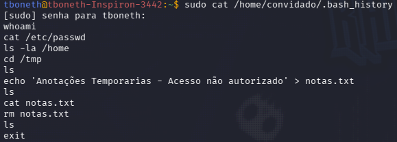
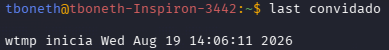
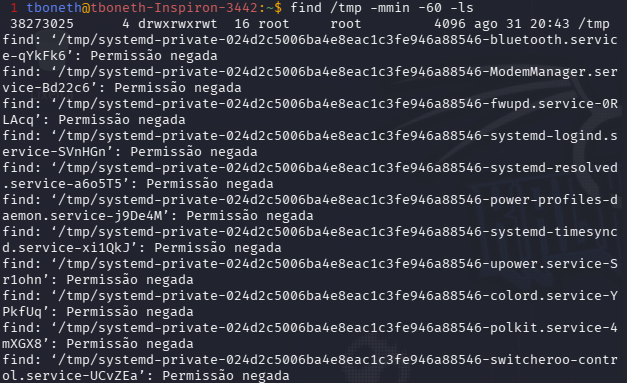

# LAB 003 — Vestígios de um Acesso

> **Categoria:** Forense Leve / Resposta a Incidentes (IR)
> **Objetivo:** simular um acesso não autorizado por um usuário local, investigar os vestígios deixados no sistema e reconstruir a linha do tempo do incidente a partir de múltiplas fontes de evidência.

## Objetivo

Neste laboratório foi simulado um cenário de acesso indevido por um usuário local, seguido de uma investigação no papel de analista, buscando reconstruir as ações realizadas a partir de evidências deixadas no sistema — histórico de comandos, registros de login e artefatos em disco.

A investigação seguiu o fluxo:

**simulação do incidente → coleta de evidências → correlação entre fontes → reconstrução da timeline.**

---

## Ambiente

| Máquina | Função |
|---|---|
| Linux Mint | Sistema onde o incidente foi simulado e investigado |
| Usuário `convidado` | Conta simulando o acesso não autorizado |
| Usuário `tboneth` | Conta usada para a investigação (papel de analista) |

---

## 1. Simulação do incidente

Foi criado um usuário local (`convidado`) para simular um acesso não autorizado. A partir dessa conta, foram executadas ações típicas de reconhecimento em um sistema comprometido: leitura de `/etc/passwd`, listagem de `/home`, navegação até `/tmp`, criação de um arquivo (`notas.txt`) e posterior remoção do mesmo arquivo, antes de encerrar a sessão.

## 2. Coleta de evidências

### 2.1 Histórico de comandos



> **Análise:** O arquivo `.bash_history` do usuário `convidado` preservou a sequência completa de comandos executados: `whoami`, `cat /etc/passwd`, `ls -la /home`, `cd /tmp`, criação do arquivo via `echo`, `cat` de verificação, `rm` do arquivo e `exit`. Essa é a evidência mais completa da investigação — sozinha, já permite reconstruir praticamente toda a ação do usuário.

### 2.2 Registro de login



> **Análise:** O comando `last convidado` não retornou nenhuma entrada de login para essa conta. Isso ocorre porque a sessão foi iniciada com `su -`, que nem sempre gera um registro em `/var/log/wtmp` da mesma forma que um login via SSH ou terminal novo — depende da configuração do PAM na distribuição. Esse é um ponto relevante da investigação: nem toda fonte de evidência retorna resultado, e uma investigação real depende de cruzar múltiplas fontes quando uma delas falha. Nesse caso, a lacuna foi coberta pelo `.bash_history`.

### 2.3 Busca por arquivos recentes



> **Análise:** A busca por arquivos modificados na última hora em `/tmp` não retornou o arquivo `notas.txt`, já que ele havia sido removido antes da busca — comportamento esperado, e o motivo pelo qual a etapa seguinte (tentativa de recuperação) foi necessária.

## 3. Tentativa de recuperação do arquivo removido

Com a partição de `/tmp` identificada (`/dev/sda2`), foi realizada uma tentativa de recuperar o conteúdo do arquivo `notas.txt` diretamente no disco.

A primeira abordagem, com a ferramenta `foremost`, não foi aplicável: o `foremost` identifica arquivos por assinatura binária (magic bytes), e um `.txt` puro não possui uma assinatura reconhecível — por isso a ferramenta não é adequada para esse tipo de conteúdo.

A alternativa avaliada foi uma busca direta pelo conteúdo do arquivo na partição bruta (`grep` sobre `/dev/sda2`). Essa abordagem foi interrompida por limitação de recursos do ambiente de laboratório (a leitura completa da partição montada e em uso consumiu I/O e memória além do que a VM suportava, resultando em travamento).

> **Análise:** A recuperação não foi concluída neste laboratório. Essa limitação foi documentada como parte do processo, e não descartada: em uma investigação real, nem toda tentativa de recuperação é bem-sucedida ou viável dentro dos recursos disponíveis, e reconhecer esse limite — em vez de forçar uma abordagem incompatível com o ambiente — também faz parte da competência de um analista.

## 4. Timeline reconstruída

```text
1. Login do usuário convidado (via su -, sem registro em last)
2. whoami
3. cat /etc/passwd
4. ls -la /home
5. cd /tmp
6. Criação do arquivo notas.txt (echo)
7. cat notas.txt (verificação)
8. rm notas.txt (remoção)
9. exit (fim da sessão)
```

## O que foi aprendido

- Como reconstruir a linha do tempo de um incidente a partir do histórico de comandos de um usuário.
- Que nem toda fonte de evidência (como `last`) retorna resultado, e por que cruzar múltiplas fontes é essencial em uma investigação.
- A diferença entre ferramentas de recuperação de arquivo baseadas em assinatura binária (foremost) e busca direta de conteúdo em disco bruto — e por que a primeira não se aplica a arquivos de texto puro.
- Que investigações reais têm limites técnicos e de ambiente, e que documentar uma tentativa sem sucesso é parte legítima do processo.

## Escopo e segurança

Este laboratório foi realizado em uma máquina virtual sob controle do autor, com finalidade exclusivamente educacional. Nenhuma ação foi realizada fora do ambiente de teste.

## Conclusão

Enquanto o LAB-001 tratou de reconhecimento externo e o LAB-002 de detecção em tempo real via log, este laboratório focou na investigação **após o fato** — competência central de resposta a incidentes (IR). O exercício reforçou que uma investigação depende de cruzar evidências de fontes diferentes, e que reconhecer os limites técnicos de uma tentativa é parte tão importante do processo quanto o próprio resultado.
