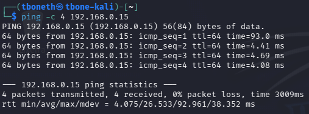
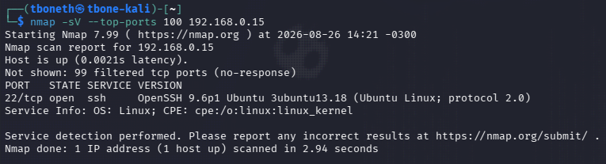
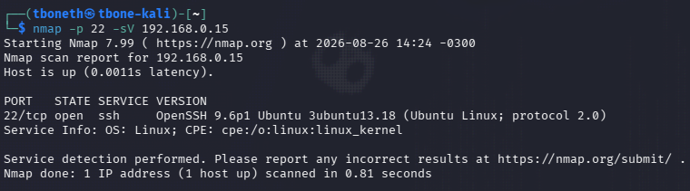
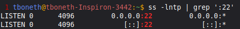
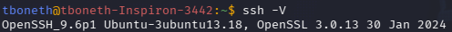
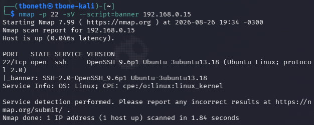
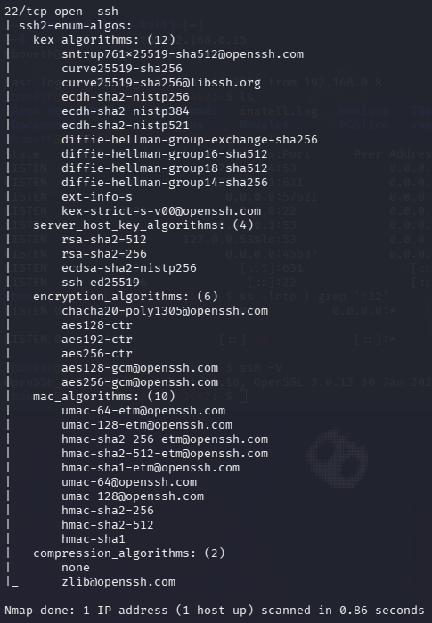

#  LAB 003 — The Exposed Service

> **Categoria:** Network Reconnaissance / Service Enumeration  
> **Foco:** SSH Enumeration, Banner Analysis & Cryptographic Algorithms

##  Objetivo

Investigar um serviço exposto no Linux Mint a partir do Kali Linux, identificando a porta, o serviço, a versão apresentada pelo host, o banner remoto e os algoritmos criptográficos suportados.

Fluxo do laboratório:

**descobrir → identificar → validar → enumerar → analisar**

##  Ambiente

| Máquina | Função | Endereço |
|---|---|---|
| Kali Linux | Máquina de análise | `10.0.2.15` |
| Linux Mint | Host alvo | `192.168.0.15` |

O Kali foi executado em uma máquina virtual através do VirtualBox. Durante a investigação, o Mint também foi acessado remotamente via SSH a partir do Kali.

---

## 1.  Verificação de conectividade

Antes da enumeração, foi confirmado que o host alvo estava acessível pela rede.



**Análise:** o teste confirmou comunicação com o Linux Mint, permitindo prosseguir para o reconhecimento.

---

## 2.  Reconhecimento com Nmap

Foi utilizado um scan direcionado às portas mais comuns, com identificação de serviços:

```bash
nmap -sV --top-ports 100 192.168.0.15
```



**Análise:** o Nmap identificou a `22/tcp` como aberta e associada ao serviço SSH. O uso de `--top-ports 100` tornou o reconhecimento mais rápido do que uma varredura completa.

---

## 3.  Confirmação da porta SSH

Depois da descoberta da porta 22, foi realizada uma verificação específica:

```bash
nmap -p 22 -sV 192.168.0.15
```



**Análise:** a `22/tcp` foi confirmada como aberta e o serviço foi identificado como SSH.

---

## 4.  Investigação local do socket

No Linux Mint:

```bash
ss -lntp | grep ':22'
```



**Análise:** o SSH estava escutando em:

```text
0.0.0.0:22
[::]:22
```

Isso indica escuta em todas as interfaces IPv4 e IPv6 disponíveis, respectivamente.

---

## 5.  Identificação da versão

No Mint foi utilizado:

```bash
ssh -V
```



**Análise:** a versão do OpenSSH instalada foi registrada como evidência local. Essa informação é útil para avaliar configuração e histórico de vulnerabilidades, mas identificar uma versão não significa automaticamente que exista uma vulnerabilidade.

---

## 6.  Banner Enumeration

No Kali:

```bash
nmap -p 22 -sV --script=banner 192.168.0.15
```



**Análise:** o banner remoto revelou a mesma versão do OpenSSH identificada diretamente no Mint. Isso demonstra que informações sobre o software podem ser obtidas remotamente sem autenticação.

---

## 7.  Enumeração dos algoritmos SSH

Foi utilizado:

```bash
nmap -p 22 --script ssh2-enum-algos 192.168.0.15
```



**Análise:** o script enumerou os algoritmos anunciados pelo servidor para Key Exchange, Host Keys, Ciphers e MACs. A presença de um algoritmo na lista não significa, por si só, que a configuração seja insegura; a avaliação depende da política e dos algoritmos efetivamente utilizados.

---

##  Resumo

| Item | Resultado |
|---|---|
| Host | `192.168.0.15` |
| Serviço | SSH |
| Porta | `22/tcp` |
| IPv4 | `0.0.0.0:22` |
| IPv6 | `[::]:22` |
| Versão | Identificada local e remotamente |
| Banner | Revelou a versão do OpenSSH |
| Algoritmos | Enumerados com `ssh2-enum-algos` |

##  O que foi aprendido

- Reconhecimento rápido com `--top-ports`.
- Identificação de serviços com `-sV`.
- Investigação de sockets com `ss`.
- Significado de `0.0.0.0`.
- Identificação de versão do OpenSSH.
- Banner enumeration.
- Enumeração de algoritmos SSH.
- Correlação entre evidências locais e remotas.
- Diferença entre identificar uma versão e comprovar uma vulnerabilidade.

##  Escopo e segurança

Este laboratório foi realizado em equipamentos e rede sob controle do autor, com finalidade educacional.

Não foram realizados brute force, exploração de credenciais ou exploração de vulnerabilidades. O objetivo foi exclusivamente praticar reconhecimento e enumeração de serviços.

##  Conclusão

A investigação evoluiu de um simples host acessível para uma caracterização detalhada do serviço SSH:

```text
Host acessível
      ↓
22/tcp aberta
      ↓
SSH identificado
      ↓
Socket confirmado no Mint
      ↓
Versão identificada
      ↓
Banner enumerado remotamente
      ↓
Algoritmos SSH enumerados
```

**Resultado final:** serviço SSH identificado e enumerado com sucesso, incluindo porta, processo, versão, banner e algoritmos suportados.
